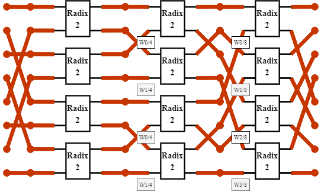
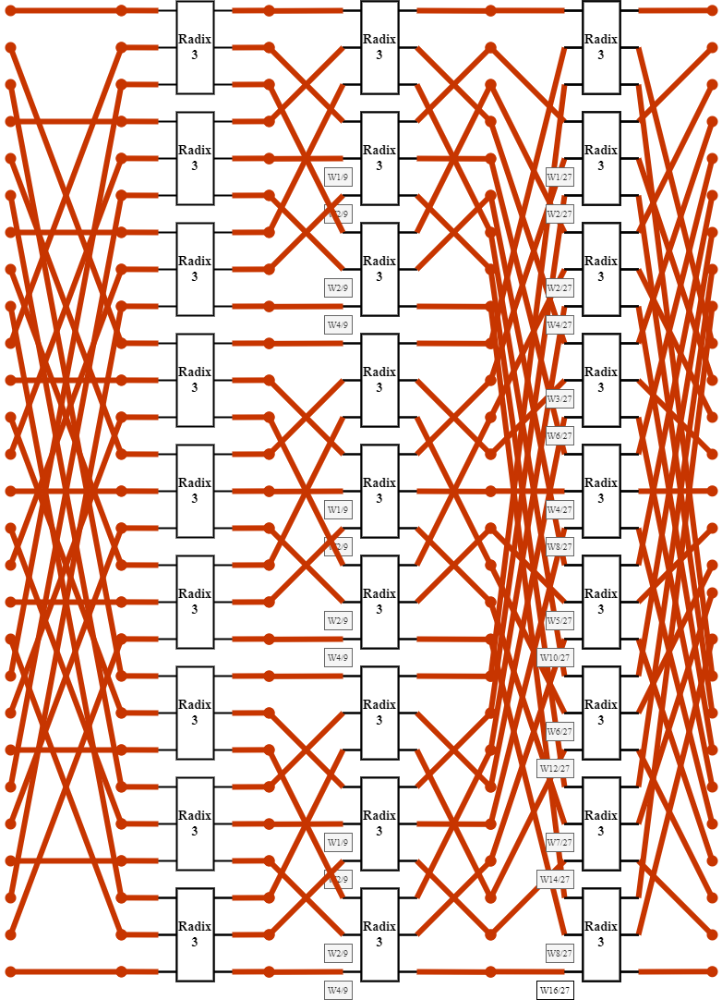

<link rel="stylesheet" href="https://cdnjs.cloudflare.com/ajax/libs/KaTeX/0.5.1/katex.min.css">

<link rel="stylesheet" href="https://cdn.jsdelivr.net/github-markdown-css/2.2.1/github-markdown.css"/>

# 一、DFT的快速计算

## 1.DFT计算公式

$$   X(k) = \sum_{n=0}^{N-1} x[n]\cdot W^{kn}_{N}   $$

其中
$$ W^{kn}_{N}=e^{-j\frac{2\pi}{N}kn} $$

## 2.当总点数为为$2^{a}$时
我们可以将其写作:
$$  X(k) = \sum_{n=0}^{\frac{N}{2}-1}x[2n]\cdot W^{2kn}_{N}+\sum_{n=0}^{\frac{N}{2}-1}x[2n+1]\cdot W^{k[2n+1]}_{N} $$
利用
$$ W^{2kn}_{N}=e^{-j\frac{2\pi}{N} \cdot 2kn}=e^{-j\frac{2\pi}{\frac{N}{2}}kn}=W^{kn}_{\frac{N}{2}} $$
我们可以得到：
$$  X(k) = \sum_{n=0}^{\frac{N}{2}-1}x[2n]\cdot W^{kn}_{\frac{N}{2}}+W^{k}_{N}\sum_{n=0}^{\frac{N}{2}-1}x[2n+1]\cdot W^{kn}_{\frac{N}{2}} $$
不难发现其中:
$$ X(k) = \sum_{n=0}^{\frac{N}{2}-1}x[2n]\cdot W^{kn}_{\frac{N}{2}} $$
为原输入信号x[n]，偶数点的傅里叶变换（共$\frac{N}{2}$个点），而且
$$ X(k) = \sum_{n=0}^{\frac{N}{2}-1}x[2n+1]\cdot W^{kn}_{\frac{N}{2}} $$
为原输入信号x[n]，奇数点的傅里叶变换（共$\frac{N}{2}$个点），所以上式可以表示为：
$$  X(k) = DFT(x[n])_{n~\epsilon~even}+W^{k}_{N} \cdot DFT(x[n])_{n~\epsilon~odd} $$
最终可以将其分解为两个点的计算

## 3.当总点数为为$3^{a}$时
我们可以将其写作:
$$  X(k) = \sum_{n=0}^{\frac{N}{3}-1}x[3n]\cdot W^{3kn}_{N}+\sum_{n=0}^{\frac{N}{3}-1}x[3n+1]\cdot W^{k[3n+1]}_{N}+\sum_{n=0}^{\frac{N}{3}-1}x[3n+2]\cdot W^{k[3n+2]}_{N} $$
同理利用
$$ W^{3kn}_{N}=e^{-j\frac{2\pi}{N} \cdot 3kn}=e^{-j\frac{2\pi}{\frac{N}{3}}kn}=W^{kn}_{\frac{N}{3}} $$
我们可以得到：
$$  X(k) = \sum_{n=0}^{\frac{N}{3}-1}x[3n]\cdot W^{3kn}_{N}+W^{k}_{N}\sum_{n=0}^{\frac{N}{3}-1}x[3n+1]\cdot W^{3kn}_{N}+W^{2k}_{N}\sum_{n=0}^{\frac{N}{3}-1}x[3n+2]\cdot W^{3kn}_{N} $$
同上:
$$ X(k) = \sum_{n=0}^{\frac{N}{3}-1}x[3n]\cdot W^{kn}_{\frac{N}{3}} $$
为原输入信号x[n]中每三个点取第一个点的傅里叶变换（共$\frac{N}{3}$个点），同理
$$ X(k) = \sum_{n=0}^{\frac{N}{3}-1}x[3n+1]\cdot W^{kn}_{\frac{N}{3}} $$
为原输入信号x[n]每三个点中取第二个点的傅里叶变换（共$\frac{N}{3}$个点），
$$ X(k) = \sum_{n=0}^{\frac{N}{3}-1}x[3n+2]\cdot W^{kn}_{\frac{N}{3}} $$
为原输入信号x[n]每三个点中取第三个点的傅里叶变换（共$\frac{N}{3}$个点），所以上式可以表示为：
$$  X(k) = DFT(x[n])_{n~\epsilon~first~of~three}+W^{k}_{N} \cdot DFT(x[n])_{n~\epsilon~second~of~three} +W^{2k}_{N} \cdot DFT(x[n])_{n~\epsilon~third~of~three}$$
最终可以将其分解为三个点的计算

##### 至此我们可以发现当点数为整数的整数次幂时都可以按照此方法分解。同理,当点数为不同基的乘积时可以用相似的方法进行分解，这里为了简便，以总点数为6点为例予以说明。

## 4.当总点数为混合基时
##### 以六点为例
原式为：
$$ X(k) = \sum_{n=0}^{5} x[n]\cdot W^{kn}_{6} $$
我们利用3中的结论,可以将其写作：
$$  X(k) = \sum_{n=0}^{1}x[3n]\cdot W^{3kn}_{6}+W^{k}_{6}\sum_{n=0}^{1}x[3n+1]\cdot W^{3kn}_{6}+W^{2k}_{6}\sum_{n=0}^{1}x[3n+2]\cdot W^{3kn}_{6} $$
再利用2中的结论：
$$  X(k) = （x[0]+W^{k}_{2} \cdot x[3]）+W^{k}_{6}(x[1]+W^{k}_{2} \cdot x[4])+W^{2k}_{6}(x[2]+W^{k}_{2} \cdot x[5]) $$
总结一下，可以根据其每一级的点数，利用不同的基进行拆分，从而达到最终系数相乘相加的简单模型。

## 5.雷德算法可以进一步优化每个基最小单元的内部结构
（待续）

# 二、结构框图
8点DFT，基为2

8点DFT，基为2
